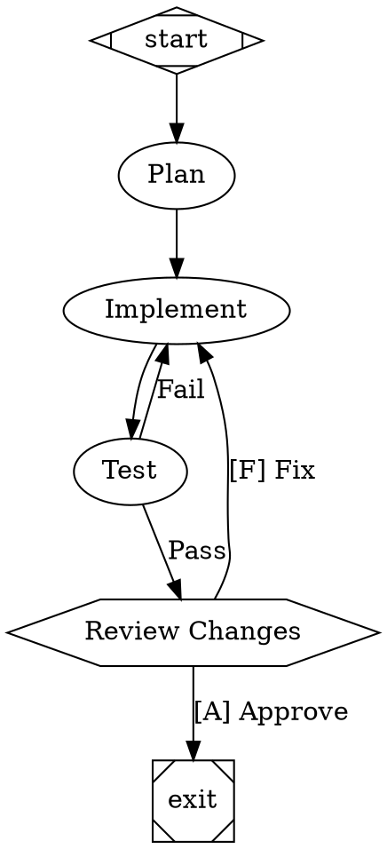
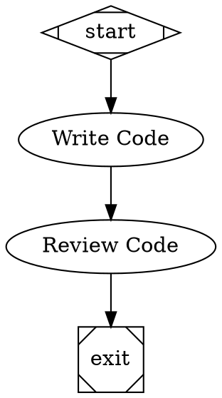
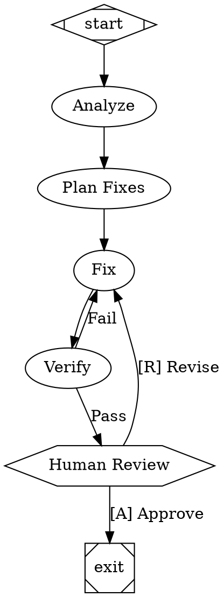
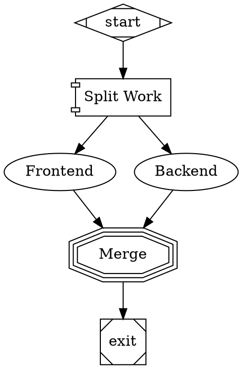
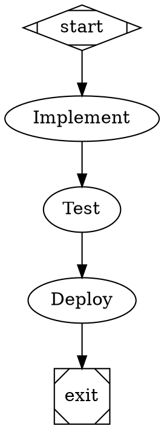

# Using Attractor

Attractor lets you define multi-stage AI workflows as visual graphs and run them. Instead of writing imperative scripts that chain LLM calls together, you draw a flowchart in a text format (DOT syntax) and the engine executes it — handling retries, checkpoints, parallel branches, human approvals, and conditional routing automatically.

This guide assumes no prior knowledge of this repository.

<p align="center">
  
</p>

## What problem does this solve?

AI-powered development workflows — code generation, code review, testing, deployment planning — often require multiple LLM calls chained together. For example:

1. Plan the implementation
2. Write the code
3. Run the tests
4. If tests fail, go back to step 2
5. Get human approval
6. Ship it

Without Attractor, you'd write a script with nested loops, error handling, retry logic, and state management. That script is hard to visualize, hard to modify, and hard to debug.

With Attractor, you define that same workflow as a graph:



The engine runs it. You get checkpoints at every step (so it can resume if it crashes), events you can stream to a UI, and a clear audit trail.

## Repository structure

This repo contains three libraries that work together:

```
attractor/          Pipeline orchestration engine (this guide)
coding-agent/       Agentic coding loop — turns an LLM into a code-editing agent
unified-llm/        Unified LLM client for Anthropic and OpenAI
```

- **unified-llm** provides a single interface for calling LLMs across providers.
- **coding-agent** wraps an LLM in a tool-using loop (read files, edit files, run commands).
- **attractor** orchestrates multi-step workflows where each step can be an LLM call, a human decision, a shell command, or a sub-pipeline.

You can use attractor without the other two libraries by providing your own LLM backend.

## Prerequisites

- [Bun](https://bun.sh/) runtime (v1.0+)
- An API key for at least one LLM provider (Anthropic, OpenAI), or a CLI agent installed (Claude Code, Codex, Gemini CLI)

## Installation

```bash
git clone <this-repo>
cd attractor
bun install
```

## Getting started: your first pipeline

### Step 1: Write a DOT file

Create a file called `my-pipeline.dot`:



This is a simple linear pipeline: start, write some code, review it, exit.

### Step 2: Run it programmatically

Create a file called `run.ts`:

```typescript
import { readFileSync } from "fs";
import {
  parse,
  PipelineRunner,
  createHandlerRegistry,
  StartHandler,
  ExitHandler,
  CodergenHandler,
  ConditionalHandler,
  StubBackend,
  AutoApproveInterviewer,
  PipelineEventEmitter,
  PipelineEventKind,
} from "attractor";

// Read and parse the DOT file
const dot = readFileSync("my-pipeline.dot", "utf-8");
const graph = parse(dot);

// Set up the handler registry (maps node shapes to execution logic)
const registry = createHandlerRegistry();
registry.register("start", new StartHandler());
registry.register("exit", new ExitHandler());
registry.register("codergen", new CodergenHandler());
registry.register("conditional", new ConditionalHandler());

// Set up event streaming so we can see what's happening
const emitter = new PipelineEventEmitter();

// Use a stub backend for now (returns mock LLM responses)
const backend = new StubBackend({
  defaultResponse: "// Generated code here\nfunction greet(name: string) { return `Hello, ${name}!`; }",
});

// Create and run the pipeline
const runner = new PipelineRunner({
  handlerRegistry: registry,
  backend,
  interviewer: new AutoApproveInterviewer(),
  eventEmitter: emitter,
});

// Listen for events in the background
(async () => {
  for await (const event of emitter.events()) {
    if (event.kind === PipelineEventKind.STAGE_STARTED) {
      console.log(`  -> Running: ${event.data["nodeId"]}`);
    }
    if (event.kind === PipelineEventKind.PIPELINE_COMPLETED) {
      console.log("  -> Pipeline finished!");
    }
  }
})();

const result = await runner.run(graph);
console.log("Status:", result.outcome.status);
console.log("Nodes completed:", result.completedNodes);
```

Run it:

```bash
bun run run.ts
```

Output:

```
  -> Running: start
  -> Running: write
  -> Running: review
  -> Pipeline finished!
Status: success
Nodes completed: ["start", "write", "review", "exit"]
```

### Step 3: Connect a real LLM

Replace the `StubBackend` with a real backend. The simplest option is `CliAgentBackend`, which spawns a CLI agent as a subprocess:

```typescript
import { CliAgentBackend } from "attractor";

// Use Claude Code as the backend
const backend = new CliAgentBackend({
  command: ["claude", "--print"],
});
```

Or use `ClaudeCodeBackend`, `CodexBackend`, or `GeminiBackend` for provider-specific integrations:

```typescript
import { ClaudeCodeBackend } from "attractor";
const backend = new ClaudeCodeBackend();
```

Or use `SessionBackend` to wrap a `coding-agent` Session for full agentic tool use:

```typescript
import { SessionBackend } from "attractor";
import { Session, createAnthropicProfile, LocalExecutionEnvironment } from "coding-agent";
import { Client } from "unified-llm";

const session = new Session({
  providerProfile: createAnthropicProfile("claude-sonnet-4-5"),
  executionEnv: new LocalExecutionEnvironment({ workingDir: process.cwd() }),
  llmClient: Client.fromEnv(),
});

const backend = new SessionBackend({ session });
```

### Step 4: Run it via the HTTP server

For remote or long-running pipelines, use the built-in HTTP server:

```bash
bun run attractor/bin/attractor-server.ts
```

Submit a pipeline:

```bash
curl -X POST http://localhost:3000/pipelines \
  -H "Content-Type: application/json" \
  -d @- <<'EOF'
{
  "dot": "digraph G { graph [goal=\"Hello\"]; start [shape=Mdiamond]; task [prompt=\"Say hello\"]; exit [shape=Msquare]; start -> task -> exit }"
}
EOF
```

The server returns a pipeline ID. Use it to check status, stream events (SSE), or answer human-in-the-loop questions:

```bash
# Check status
curl http://localhost:3000/pipelines/<id>

# Stream events
curl http://localhost:3000/pipelines/<id>/events

# Get pending question (if pipeline is waiting for human input)
curl http://localhost:3000/pipelines/<id>/questions

# Answer a question
curl -X POST http://localhost:3000/pipelines/<id>/questions \
  -H "Content-Type: application/json" \
  -d '{"value": "approve"}'
```

## Key concepts

### Nodes are tasks

Every node in the graph is a task. The node's `shape` attribute determines what kind of task it is:

- **`box`** (default) — LLM call. The `prompt` attribute is sent to the LLM backend.
- **`hexagon`** — Human gate. The pipeline pauses and waits for a human to choose an option.
- **`diamond`** — Conditional routing. No execution; edges are selected based on conditions.
- **`component`** — Parallel fan-out. Multiple branches run concurrently.
- **`parallelogram`** — Tool/shell command. Runs a command specified in `tool_command`.

### Edges are transitions

Edges connect nodes and control flow. They can have:

- **`label`** — Display name and routing key. If a handler returns a preferred label, the matching edge is chosen.
- **`condition`** — Boolean expression evaluated against the pipeline context (e.g., `outcome=success`).
- **`weight`** — Numeric priority. Higher weight wins among equally eligible edges.

### Context flows through the pipeline

Context is a key-value store that accumulates state as the pipeline runs. Handlers can read from it and write to it via `contextUpdates` in their `Outcome`. The engine automatically sets values like `outcome` (status of the last node) and `graph.goal`.

### Checkpoints enable resume

After every node completes, the engine saves a checkpoint. If the process crashes, you can resume from the last checkpoint. Checkpoints are JSON files written to `logsRoot`.

### Human-in-the-loop

When the pipeline reaches a `wait.human` node (hexagon shape), it pauses and presents the outgoing edge labels as choices to the human. The human's selection determines which edge to follow.

Edge labels can include accelerator keys: `[A] Approve`, `[F] Fix`. The key in brackets is the keyboard shortcut in the console interviewer.

## Practical examples

### Code review pipeline



### Parallel implementation



### Pipeline with retries and goal gates



The `goal_gate=true` on the test node means the pipeline cannot exit unless tests pass. If it reaches the exit node with a failed test, it jumps back to `retry_target="implement"` and tries again.

## Running tests

```bash
# Run attractor tests
cd attractor && bun test

# Run all workspace tests
bun test --filter attractor
bun test --filter coding-agent
bun test --filter unified-llm
```

## What's next

- Read the [attractor README](./attractor/README.md) for the full API reference
- Read the [coding-agent README](./coding-agent/README.md) to understand the agentic loop
- Read the [unified-llm README](./unified-llm/README.md) for provider-agnostic LLM access
- Look at the [attractor spec](./docs/specs/attractor-spec.md) for the complete specification
